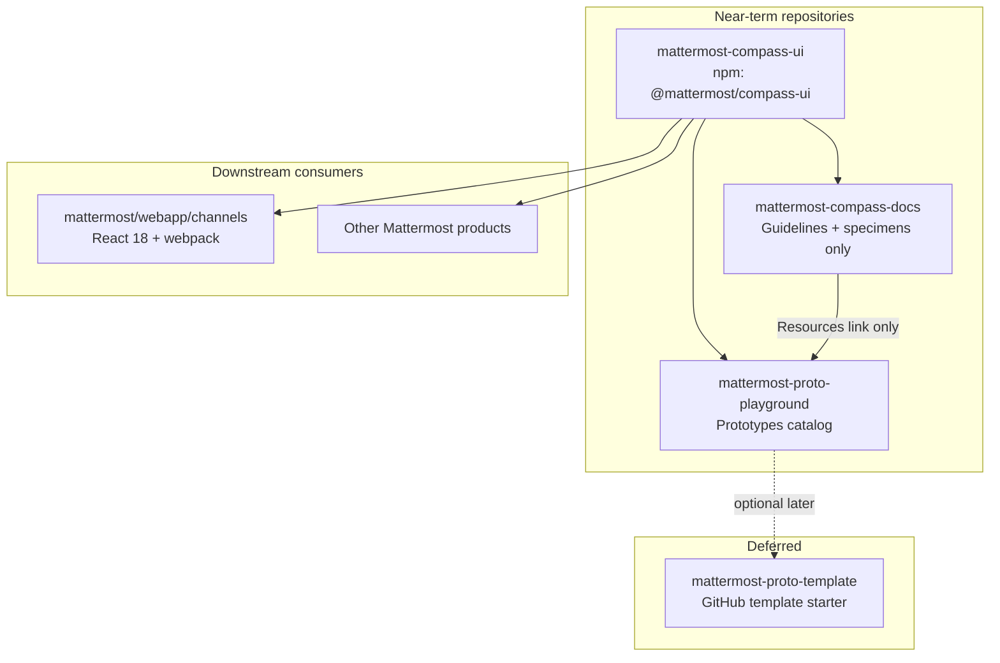
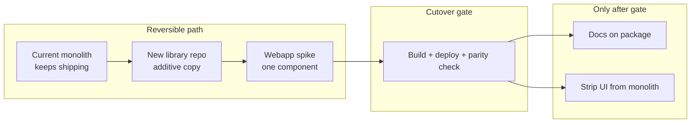

# Compass UI Library Extraction Plan

## Recommended scope (your question)

**Use a tiered rollout inside one npm package**, not “primitives only” and not “all 81 folders on day one.”


| Tier                     | Contents                                                                                                                 | Why this order                                                                                                                                                                                                                                     |
| ------------------------ | ------------------------------------------------------------------------------------------------------------------------ | -------------------------------------------------------------------------------------------------------------------------------------------------------------------------------------------------------------------------------------------------- |
| **Tier 0 — Foundations** | `[tokens.scss](src/styles/tokens.scss)`, `[themes.scss](src/styles/themes.scss)`, optional font entry                    | Every component depends on CSS variables; webapp needs the same token contract                                                                                                                                                                     |
| **Tier 1 — Primitives**  | ~25 folders: `Button`, `Icon`, `IconButton`, form controls, `Modal`, `Tooltip`, `Scrollbars`, badges, `EmptyState`, etc. | Lowest coupling, highest reuse; best first target for webapp                                                                                                                                                                                       |
| **Tier 2 — Composites**  | Message stack, `PopoverMenu`, `Dropdown`, `ProfilePopover`, admin panels                                                 | Depends on Tier 1; still mostly prop-driven                                                                                                                                                                                                        |
| **Tier 3 — Patterns**    | `ChannelsSidebar`, `CallWidget`, `GlobalHeader`, `ChannelShell`, etc.                                                    | Blocked today by fixture imports (`[ChannelShell](src/components/ui/ChannelShell/ChannelShell.tsx)`, `[ThreadListItem](src/components/ui/ThreadListItem/ThreadListItem.tsx)`, `[DialpadIcon](src/components/icons/DialpadIcon.tsx)` outside `ui/`) |


Expose tiers via **subpath exports** so consumers can adopt incrementally without splitting into multiple npm packages yet:

```json
{
  "exports": {
    ".": "./dist/index.js",
    "./styles": "./dist/compass-ui.css",
    "./tokens": "./dist/tokens.css",
    "./button": "./dist/components/Button/index.js",
    "./patterns": "./dist/patterns/index.js"
  }
}
```

This replaces the archived `[@mattermost/compass-components](https://github.com/mattermost/compass-components)` (last published 0.2.12; still a webapp dependency Mattermost wants to remove) with a modern successor — **do not revive the old package name**.

---

## Target architecture (three repos now; template deferred)




### Where the prototype collection goes

**Recommendation: a dedicated prototypes catalog repo — keep the name `mattermost-proto-playground`.**

For now, **three repos are enough**. The separate template repo is a nice-to-have, not a blocker:


| Repo                                        | Priority     | Purpose                                                            |
| ------------------------------------------- | ------------ | ------------------------------------------------------------------ |
| `**mattermost-compass-ui`**                 | Now          | npm package + Storybook                                            |
| `**mattermost-compass-docs`**               | Now          | Guidelines + specimens; no prototypes                              |
| `**mattermost-proto-playground`** (catalog) | Now          | Browseable collection of flow experiments                          |
| `**mattermost-proto-template`**             | **Deferred** | Empty "Use this template" scaffold for new AI prototyping sessions |


**Starting new prototypes without a template repo:** copy `[example-flow](src/pages/prototypes/example-flow/)` inside the catalog (or duplicate its folder structure), register in `[prototypes.ts](src/manifests/prototypes.ts)`, and follow the catalog's `[CLAUDE.md](CLAUDE.md)`. The catalog already has the chrome (`PrototypeTopNav`, `SceneSwitcher`, multi-scene folder conventions). Extract a standalone template only when copy-paste from `example-flow` feels too heavy — e.g. many people forking the full catalog just to start one flow.

Why the catalog is its own repo (not docs):

- **Catalog can grow freely** — each prototype is a folder under `src/pages/prototypes/` with its own scenes and fixtures; no docs manifest or MDX pipeline.
- **Name already fits** — retains the existing GitHub Pages URL (`/mattermost-proto-playground/`).
- **Clean docs boundary** — docs links out via Resources; no embedded `/prototypes` routes.

**Workflow after split (no template yet):**

1. New exploration → copy `example-flow` in `**mattermost-proto-playground`**, or work on a branch
2. Build the flow → iterate locally
3. When ready → merge PR into catalog main (add entry to `[prototypes.ts](src/manifests/prototypes.ts)`)
4. Docs site never hosts prototype code — only links to the catalog deployment

**Catalog repo structure** (evolved from current prototype infrastructure):

```
mattermost-proto-playground/
├── src/
│   ├── pages/prototypes/          # one folder per flow
│   │   ├── outbound-calls/
│   │   ├── external-call-participants/
│   │   └── …
│   ├── manifests/prototypes.ts    # registry + routes
│   ├── components/
│   │   ├── layout/                # AppShell, PrototypeTopNav only
│   │   └── navigation/            # SceneSwitcher
│   ├── contexts/                  # PrototypeChromeContext, ThemeContext
│   └── assets/                    # prototype fixture avatars
├── CLAUDE.md                      # prototyping rules (not docs-authoring rules)
└── deploy → GitHub Pages prototype index
```

No MDX, no `topics.ts`, no doc sidebar, no specimen tabs.

**What moves where**


| **UI library**                                                   | **Docs repo**                                                                                              | **Prototypes catalog** (`mattermost-proto-playground`)                                                                                                                  |
| ---------------------------------------------------------------- | ---------------------------------------------------------------------------------------------------------- | ----------------------------------------------------------------------------------------------------------------------------------------------------------------------- |
| `[src/components/ui/](src/components/ui/)` (tiered)              | `[src/guidelines/](src/guidelines/)` MDX + specimens                                                       | `[src/pages/prototypes/](src/pages/prototypes/)` (all flows)                                                                                                            |
| `[src/hooks/](src/hooks/)` (3 UI hooks)                          | `[topics.ts](src/manifests/topics.ts)`, `[sections.ts](src/manifests/sections.ts)`                         | `[prototypes.ts](src/manifests/prototypes.ts)`, prototype routing                                                                                                       |
| `[src/utils/string.ts](src/utils/string.ts)`                     | Docs layout (`[TopNav](src/components/layout/TopNav/)`, `[DocsLayout](src/components/layout/DocsLayout/)`) | `[PrototypeTopNav](src/components/layout/PrototypeTopNav/)`, `[AppShell](src/components/layout/AppShell/)`, `[SceneSwitcher](src/components/navigation/SceneSwitcher/)` |
| `[src/styles/tokens.scss](src/styles/tokens.scss)` → package CSS | `[library-demo/](src/styles/library-demo/)` styles                                                         | Prototype-local SCSS; `[CLAUDE.md](CLAUDE.md)` for new-flow conventions                                                                                                 |
| `[src/components/icons/](src/components/icons/)`                 | Resources page → external catalog link                                                                     | Prototype-only icons, call fixtures, avatars                                                                                                                            |
| `[src/types/callParticipant.ts](src/types/callParticipant.ts)`   | —                                                                                                          | `[outboundCall.ts](src/types/outboundCall.ts)`, `[phoneSounds.ts](src/utils/phoneSounds.ts)`                                                                            |


---

## Order of operations

### Phase 0 — Decisions and spike (1–2 days)

Do this before moving files. **This phase is fully reversible** — abandon by deleting the new repo.

1. **Create `mattermost-compass-ui` repo** with library-oriented tooling (not the docs Vite app). **Do not modify the monolith yet.**
2. **Spike the build** against one component (`Button`) + tokens CSS:
  - React **18.2** peer dep (`"react": "^18.2.0"`, `"react-dom": "^18.2.0"`)
  - Library bundler: **Vite library mode** (team already uses Vite) or **tsup** — pick one after spike
  - CSS strategy: compile SCSS modules → single consumable CSS file + preserve hashed class names
  - Dual format: **ESM + CJS** (Mattermost webapp uses npm workspaces + webpack)
3. **Validate in Vite consumers first**: install the packed tarball (or `file:../`) into **mattermost-compass-docs** and **mattermost-proto-playground** and render `<Button>` with `import '@mattermost/compass-ui/styles'`. Both use the same Vite + React stack as this repo today — fail fast on CSS module / token issues before migrating 80 components. **Mattermost webapp (`webapp/channels`) is a later target** (Phase 6); webpack compatibility can be spiked separately when ready.

**Critical technical constraints discovered in this repo:**

- Components never import tokens directly — they assume CSS variables from global `[global.scss](src/styles/global.scss)`. The library must ship `@mattermost/compass-ui/styles` (tokens + themes) that consumers import once.
- `[ThemeContext](src/contexts/ThemeContext.tsx)` only sets `data-theme` on `<html>` — keep this as an optional helper in the library or docs; components stay CSS-var-based.
- Downgrade playground/docs to React 18 during extraction (currently React 19 in `[package.json](package.json)`) to avoid dual React trees when linking locally.

---

### Phase 1 — UI library foundations (week 1)

**Repo:** `mattermost-compass-ui`

1. **Package layout**

```
packages/compass-ui/   (or repo root)
├── src/
│   ├── components/     # migrated from ui/
│   ├── hooks/
│   ├── utils/
│   ├── styles/           # tokens, themes, reset (no library-demo)
│   └── index.ts          # root barrel (new — doesn't exist today)
├── .storybook/
├── vite.config.ts        # lib build
├── package.json
└── tsconfig.json
```

1. **Migrate Tier 0 + Tier 1** with import rewrites (`@/` → relative or `@mattermost/compass-ui` internal alias).
2. **Add shared infra:**
  - Root `[index.ts](src/components/ui/Button/index.ts)` barrel + consistent per-component barrels (8 folders today lack them: `Message`, `Divider`, etc.)
  - `sideEffects: ["*.css"]` in `package.json`
  - ESLint + Prettier aligned with current repo
3. **CI:** `lint`, `typecheck`, `build`, `npm pack` artifact; publish to GitHub Packages or npm org (private until stable).

---

### Phase 2 — Storybook in the UI library (week 1–2)

Add Storybook **after** Tier 1 builds cleanly — it becomes the component catalog for library + webapp teams.

1. **Setup:** `@storybook/react-vite` + SCSS support matching lib build.
2. **Global decorators:**
  - Import `@mattermost/compass-ui/styles`
  - Theme toolbar → `data-theme` (`denim`, `onyx`, etc. from `[themes.scss](src/styles/themes.scss)`)
  - Font faces (`@fontsource/metropolis`, `@fontsource/open-sans`)
3. **Story sources (in priority order):**
  - Co-located `Component.stories.tsx` for Tier 1
  - Port content from existing `[*.specimen.tsx](src/guidelines/components/button/button.specimen.tsx)` files (variant matrices already written)
  - Add interaction tests later (`@storybook/addon-a11y`, optional Chromatic)
4. **Do not duplicate** the full docs shell (Guidelines prose, sidebar, OnThisPage) — Storybook covers component API/variants; docs repo keeps product guidance.

---

### Phase 3 — Tier 2 + Tier 3 components (week 2–3)

1. **Decouple fixtures first** (required before Tier 3):
  - Replace hardcoded `@/assets/avatars/`* in `ChannelShell`, `ThreadListItem`, `RightSidebarThread` with props / default `undefined`
  - Move `[DialpadIcon](src/components/icons/DialpadIcon.tsx)` into library
2. Migrate remaining `[src/components/ui/](src/components/ui/)` folders tier-by-tier.
3. Expand Storybook coverage per tier.

---

### Phase 4 — Extract docs repo (week 3)

**New repo:** `mattermost-compass-docs` (or rename after catalog splits out)

**Prerequisite:** library Tier 1+ builds; at least one parallel-run week where both monolith and package work.

1. **Copy** docs shell + guidelines into new repo (or branch); add `"@mattermost/compass-ui": "^0.x"` — do not strip the monolith until the new docs deploy succeeds.
2. Replace all `@/components/ui/...` imports (~150+ files in `[src/guidelines/](src/guidelines/)`) with package imports.
3. Keep: MDX guidelines, `[topics.ts](src/manifests/topics.ts)`, doc shell, GitHub Pages deploy.
4. **Remove entirely:** `[src/pages/prototypes/](src/pages/prototypes/)`, `[prototypes.ts](src/manifests/prototypes.ts)`, prototype routes, `PrototypeTopNav` / `PrototypeChromeContext`, `[PrototypesIndex](src/pages/prototypes/PrototypesIndex.tsx)`.
5. **Resources page:** replace in-app `/prototypes` nav with an external link to the catalog deployment (e.g. `https://mattermost.github.io/mattermost-proto-playground/`).
6. **Specimen tabs:** continue importing from `@mattermost/compass-ui` — specimens become thin wrappers, not the source of truth (Storybook is).

---

### Phase 5a — Prototypes catalog (week 3)

**Repo:** `mattermost-proto-playground` (evolve the current repo, or create fresh and redirect)

This is where the **collection of prototypes** lives.

1. Strip docs/UI from the current repo (after Phase 4 creates `mattermost-compass-docs`).
2. Keep and migrate:
  - All of `[src/pages/prototypes/](src/pages/prototypes/)` (outbound-calls, external-call-participants, example-flow, …)
  - `[prototypes.ts](src/manifests/prototypes.ts)` + prototype-only router entries
  - Prototype chrome: `[AppShell](src/components/layout/AppShell/AppShell.tsx)`, `[PrototypeTopNav](src/components/layout/PrototypeTopNav/)`, `[PrototypeChromeContext](src/contexts/PrototypeChromeContext.tsx)`, `[SceneSwitcher](src/components/navigation/SceneSwitcher/)`
  - Prototype fixtures: `[src/types/outboundCall.ts](src/types/outboundCall.ts)`, `[phoneSounds.ts](src/utils/phoneSounds.ts)`, prototype avatars
3. Add dependency: `"@mattermost/compass-ui": "^0.x"`.
4. Landing page becomes a **prototype index** (evolved from `[PrototypesIndex](src/pages/prototypes/PrototypesIndex.tsx)`) — not a docs home page.
5. Keep GitHub Pages deploy on the existing base path.
6. Keep `[example-flow](src/pages/prototypes/example-flow/)` as the **in-repo starter pattern** for new prototypes until a standalone template repo is worth creating.
7. `[CLAUDE.md](CLAUDE.md)` scoped to prototyping (folder structure, scene switcher, avatar fixtures) — not docs-authoring rules.

---

### Future — Prototype template (deferred)

**Repo:** `mattermost-proto-template` — only when the catalog copy-paste workflow is insufficient.

Slice from catalog infrastructure:

- Vite + React 18 + `@mattermost/compass-ui`
- Prototype chrome + one minimal example prototype
- GitHub **"Use this template"** for clean AI session starts without cloning the full catalog

Trigger to build this: multiple people forking the entire catalog repo just to add one flow, or template hygiene (keeping WIP out of the shared catalog) becomes a recurring pain.

---

### Phase 6 — Mattermost webapp adoption (ongoing, post-v0.1)

This is the long tail; plan for it now, execute after Tier 1 publishes.

1. **Install** `@mattermost/compass-ui` in `webapp/channels` workspace alongside legacy `@mattermost/compass-components`.
2. **Import pattern:**

```tsx
import { Button } from '@mattermost/compass-ui';
import '@mattermost/compass-ui/styles';
// App root: data-theme="denim" (existing Mattermost theme system may already set vars)
```

1. **Migration strategy:** leaf-first — new code uses compass-ui; replace compass-components usages file-by-file (Button, Text equivalents, etc.).
2. **Webpack checklist:** CSS module class names match, no duplicate React, SCSS `@use` not required in consumer, source maps for debugging.
3. **Storybook** becomes the shared reference — link from internal docs; optionally deploy Storybook static site.
4. **Align React:** webapp is on React 18.2; library peer dep `^18.2.0`. Playground/docs/catalog downgrade to 18 during extraction.

---

## Build and publish design

**Recommended `package.json` skeleton:**

```json
{
  "name": "@mattermost/compass-ui",
  "peerDependencies": {
    "react": "^18.2.0",
    "react-dom": "^18.2.0",
    "@mattermost/compass-icons": "^0.1.53",
    "simplebar-react": "^3.3.2"
  },
  "exports": { /* subpaths per tier */ },
  "sideEffects": ["**/*.css"]
}
```

**CSS contract for all consumers:**

1. Import `@mattermost/compass-ui/styles` once at app entry.
2. Set `data-theme` on `<html>` (or ensure Mattermost theme vars are present).
3. Load fonts (document as peer optional package or `@mattermost/compass-ui/fonts` subpath).

**Internal composition today:** ~57 UI files cross-import. Keep them in one package initially — splitting into `@mattermost/compass-patterns` is a future option if bundle size demands it.

---

## Reversibility — is this a one-way door?

**No, if you follow an additive, parallel-run strategy.** Most steps are two-way doors. A few become harder to undo only after wide downstream adoption.

### Two-way doors (easy to walk back)

| Step | Why it's reversible |
|------|---------------------|
| **Phase 0 spike** (Button + build in a new repo) | Delete the new repo; current playground unchanged |
| **Storybook in the library** | Additive tooling; doesn't affect the monolith |
| **New repo alongside the monolith** | Original repo keeps working until you explicitly cut over |
| **Local `file:../` linking** | Docs/catalog can consume the library without publishing to npm |
| **Docs/catalog split** | Repos can be re-merged (messy) or the monolith kept as an archived fallback |
| **Webapp tries one component** | `@mattermost/compass-ui` can coexist with legacy `@mattermost/compass-components`; revert the import |

There is no database migration, no user data, and no runtime config lock-in — this is code and repo organization.

### One-way-ish doors (harder, not impossible)

| Step | What makes it sticky | How to keep the door open |
|------|----------------------|---------------------------|
| **Publishing npm + wide adoption** | Semver/API contracts; other teams depend on import paths | Stay on `0.x` alpha until validated; use GitHub Packages internally first |
| **Deleting source from the monolith before the library is stable** | Lose the single-repo convenience | **Don't delete — copy first, cut over only after parity** |
| **Mass webapp migration** | Hundreds of import rewrites | Leaf-first, one component at a time; no big-bang swap |
| **Renaming/rehoming GitHub repos** | Bookmarks, CI, Pages URLs break | Keep old repo as redirect/archive; don't rename until new setup is proven |

### Recommended safety rails (bake into execution)

1. **Copy, don't move** — first pass duplicates `src/components/ui/` into the library repo; monolith keeps working on `main`.
2. **Parallel-run window** — run both setups for at least one sprint: monolith builds, library builds, one consumer (docs or catalog) on the package.
3. **Archive, don't delete** — after cutover, tag the last monolithic commit (`pre-split`) and keep the repo (or a branch) read-only for reference and bisect.
4. **Gate the cutover** — docs/catalog switch to `@mattermost/compass-ui` only when: build passes, specimens/Storybook match, deploy succeeds.
5. **Phase 0 is the escape hatch** — if the webapp webpack spike fails, you learn that before touching 80 components or splitting repos.



**Bottom line:** Starting Phase 0 commits you to a few days of exploration, not an irreversible split. The point of no return is really **"we deleted the monolith source and multiple teams depend on the published API"** — which the plan deliberately delays.

---

## Risk register


| Risk                                       | Mitigation                                                                             |
| ------------------------------------------ | -------------------------------------------------------------------------------------- |
| CSS variables missing in webapp            | Ship explicit styles entry; document required `data-theme`; integration test in webapp |
| Webpack vs Vite CSS module mismatch        | Validate in Vite first (docs/playground); webapp webpack spike deferred to Phase 6       |
| React 19 vs 18 drift                       | Standardize on 18 now across library, docs, and catalog                                |
| Specimen ↔ Storybook duplication           | Storybook = source of truth for variants; specimens become thin imports                |
| Large pattern components with fixture data | Tier 3 gated on prop refactors                                                         |
| Old compass-components overlap             | Map 1:1 replacement table; deprecate incrementally in webapp                           |


---

## Suggested timeline


| Week    | Milestone                                                                   |
| ------- | --------------------------------------------------------------------------- |
| 1       | UI library repo + Tier 0/1 + build + validate in docs/playground (Vite)   |
| 2       | Storybook for Tier 1 + publish v0.1.0-alpha                                 |
| 3       | Tier 2/3 + docs repo cutover (prototypes removed)                           |
| 4       | Prototypes catalog (`mattermost-proto-playground`)                          |
| 5       | Webapp first PR (Button/Icon)                                               |
| Later   | Prototype template repo (if copy-from-`example-flow` workflow isn't enough) |
| Ongoing | Expand Storybook, migrate webapp off compass-components                     |


---

## What not to do

- **Don't** delete monolith UI source until the library consumer deploy is validated — copy first, cut over second, archive last.
- **Don't** put the prototype collection in the docs repo — catalog is the home for shared explorations.
- **Don't** block the split on a template repo — `example-flow` in the catalog is enough to start.
- **Don't** keep specimens as the only component catalog — invest in Storybook early.
- **Don't** require MDX in the UI library repo.
- **Don't** bundle `@mattermost/compass-icons` — keep as peer dep (already external in webapp).
- **Don't** move doc-only styles (`[library-demo/](src/styles/library-demo/)`) into the library.

